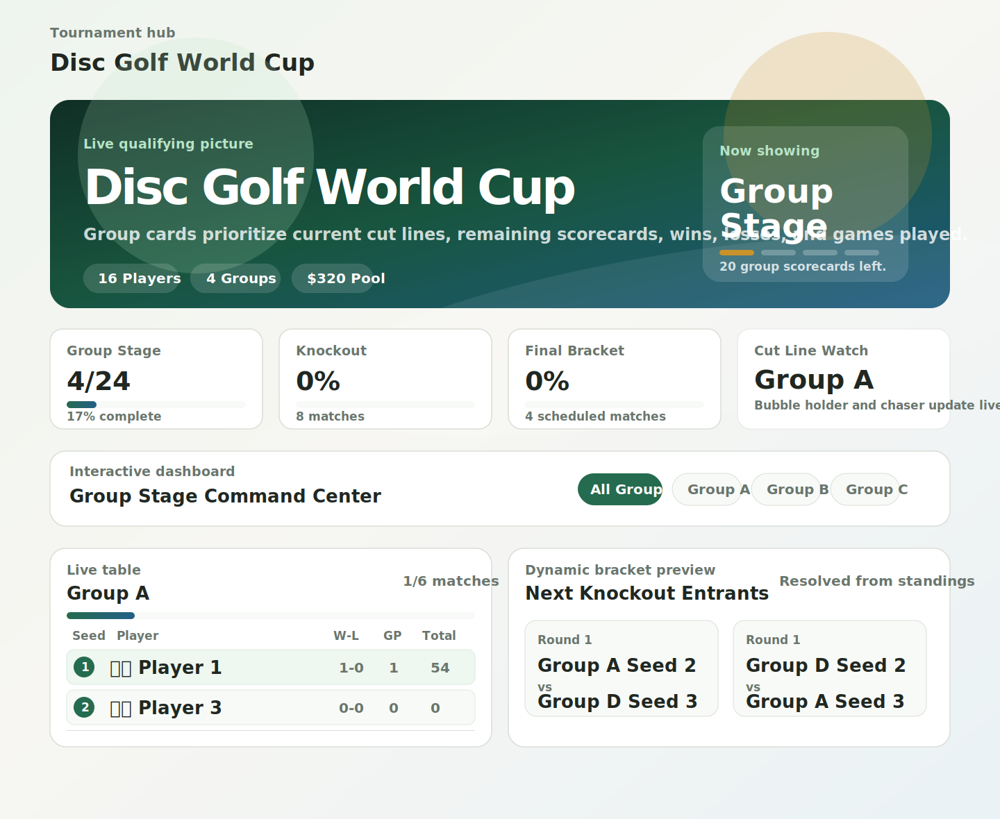
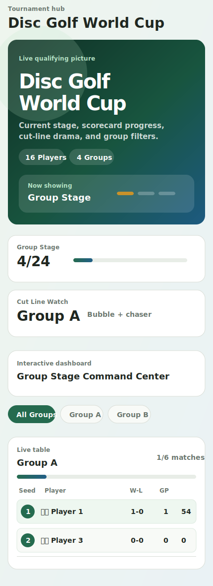

# Dashboard Preview

These preview artifacts are included so the dashboard redesign can be reviewed visually in a cloud PR before pushing/deploying. They are static SVG previews of the current dashboard direction and do **not** modify tournament data.

## Desktop preview



## Mobile preview



## Local live preview command

If you have the repo locally, run:

```sh
cd disc-golf-tournament
npm run dev -- --host 127.0.0.1
```

Then open:

```text
http://127.0.0.1:5173/disc-golf-world-cup/#access=worldcup2026
```

## Environment note

I attempted to install/use browser screenshot tooling in the cloud environment, but both npm package fetches and apt package fetches are blocked by the configured proxy/security policy. These SVGs are therefore committed as PR-visible previews so the design can be inspected without needing access to the agent's local dev server.
